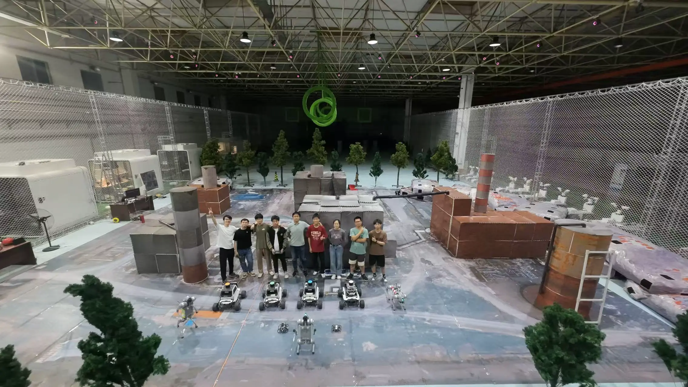
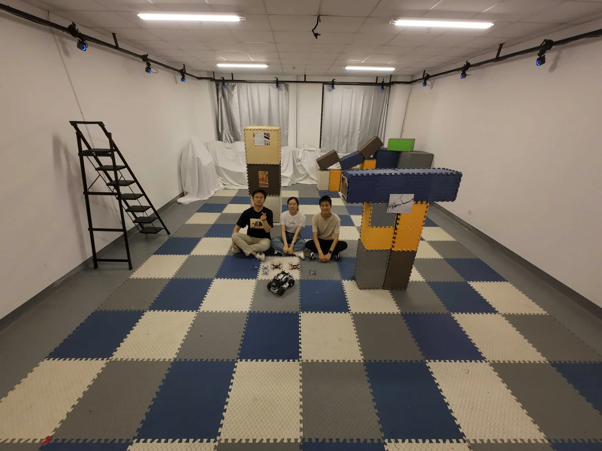

# 🤖 Mul[t]()i-[R]()obot [I]()ntelligence Gr[o]()up (TRIO)

Welcome to the **Multi-Robot Intelligence Group**, 
where we explore the intersection of **Artificial Intelligence**, **Optimization**, and **Multi-Robot Systems** to build the future of intelligent autonomy — for good.

---

## ✨ Who We Are

> "From research to real-world impact."

Our founding team consists of passionate researchers and students from top-tier institutions:

  

- 🧠 **[Junfeng Chen](https://example.com/junfeng)** — Ph.D. at *Peking University*, team leader  
- 🔍 **[Yuxiao Zhu](https://tcxm.github.io/)** — Junior undergraduate student at *Duke Kunshan University*  
- 🦾 **[Xintong Zhang](https://example.com/xintong)** — Junior undergraduate student at *Duke Kunshan University*  

Together, we are committed to unlocking the full potential of **multi-agent robotic systems**, making them smarter, safer, and more helpful to humans in complex environments.

---

## 🚀 What We Do

Our mission is to empower robots with:

 

### 💡 **Multi-Robot Task Planning**  

 

### 🧩 **Multi-Robot Dynamic Hybrid Optimization Planning**  
<!-- 没有catch.gif视频，选择最相关视频 intelligent catching multi robot system.mp4 -->

 

### 🧠 **LLM-Based Multi-Robot Task Planning in Dynamic Unknown Environments**  
<!-- dexter.webm/llm.gif不存在，插入dexter.mp4和llm.mp4视频 -->

  
  

 

### 🔗 **Multi-Robot Task Planning under Communication Constraints**  
<!-- slei3D-1.gif/comm-1.webm不存在，插入slei3D-1.mp4和comm-1.mp4视频 -->

  
  

 

---

## 🍿 Fun Fact

We believe in the power of collaboration, innovation, and continuous learning. Our team thrives on solving complex problems, pushing the boundaries of robotics, and making a tangible impact on the world.

---

> 🌟 *"The future belongs to those who dare to innovate and collaborate."*

---

## 📄 License

All code and documents in this organization are licensed under the [MIT License](./LICENSE), unless otherwise specified.

