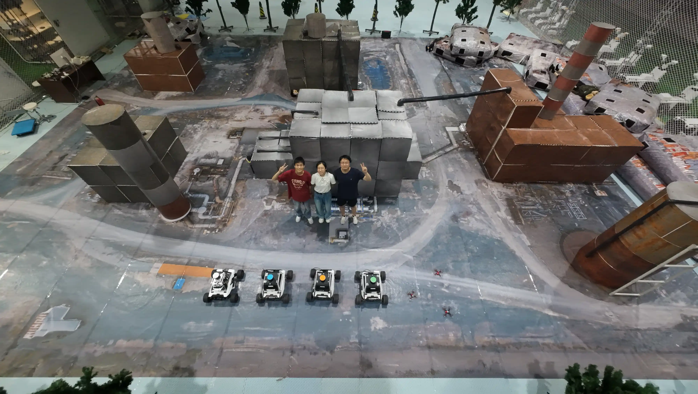

# 🤖 Mul<u>t</u>i-<u>R</u>obot <u>I</u>ntelligence Gr<u>o</u>up (TRIO)

Welcome to the **Multi-Robot Intelligence Group**, where we explore the intersection of **Artificial Intelligence**, **Optimization**, and **Multi-Robot Systems** to build the future of intelligent autonomy — for good.

---

## ✨ Who We Are

> "From research to real-world impact."

Our founding team consists of passionate researchers and engineers from top-tier institutions:

- 🧠 **Junfeng Chen** — Ph.D. at *Peking University*, team leader
- 🔍 **Yuxiao Zhu** — Junior undergraduate student at *Duke Kunshan University*
- 🦾 **Xintong Zhang** — Junior undergraduate student at *Duke Kunshan University*

Together, we are committed to unlocking the full potential of **multi-agent robotic systems**, making them smarter, safer, and more helpful to humans in complex environments.

---

## 🚀 What We Do

Our mission is to empower robots with:

- 💡 **AI-Driven Perception** (YOLO, Fast-LIO, Semantic SLAM)
- 🧩 **Real-Time Planning & Control** (Receding Horizon, MPC)
- 🧠 **LLM-Enhanced Human-Robot Interaction**
- 🔗 **Cloud-Edge-End Intelligence Architecture**
- 🛟 **Applications** in disaster response, exploration, and collaborative autonomy

---

## 🍿 Fun Fact

We code with passion, debug with curiosity — and fuel ourselves with coffee, bubble tea, and curiosity.

---

> 🧙‍♂️ *"You can do mighty things with Markdown — and even mightier ones with multi-robot intelligence."*

---

## 📄 License

All code and documents in this organization are licensed under the [MIT License](./LICENSE), unless otherwise specified.

